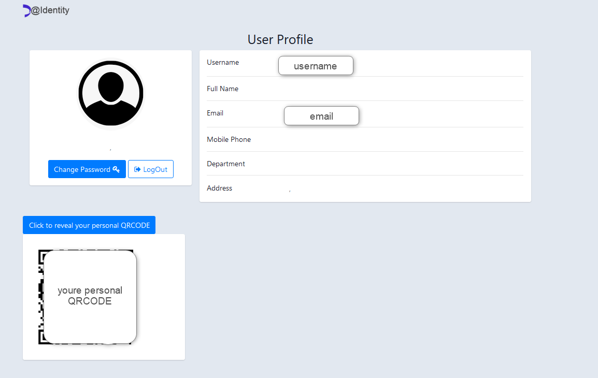

# Django Project for Self service Password Change and Reset

Project written form organization necessity for users self service password change and reset.
Project make use mainly of Ldap3 and PyOtp library, gives users the ability to either change there own password or reset using either Google Autentication App or email type OTP , configured from adminstratos 
 control.
<h3>login page</h3>

<h3>Personal profile</h3>

<h3>Personal profile with personal genrated QRcode</h3>

<h3>User Can Change its own password</h3>

<h3>Password Reset request form</h3>

<h3>MFA type Google and Email</h3>

h3>Password Reset form</h3>

